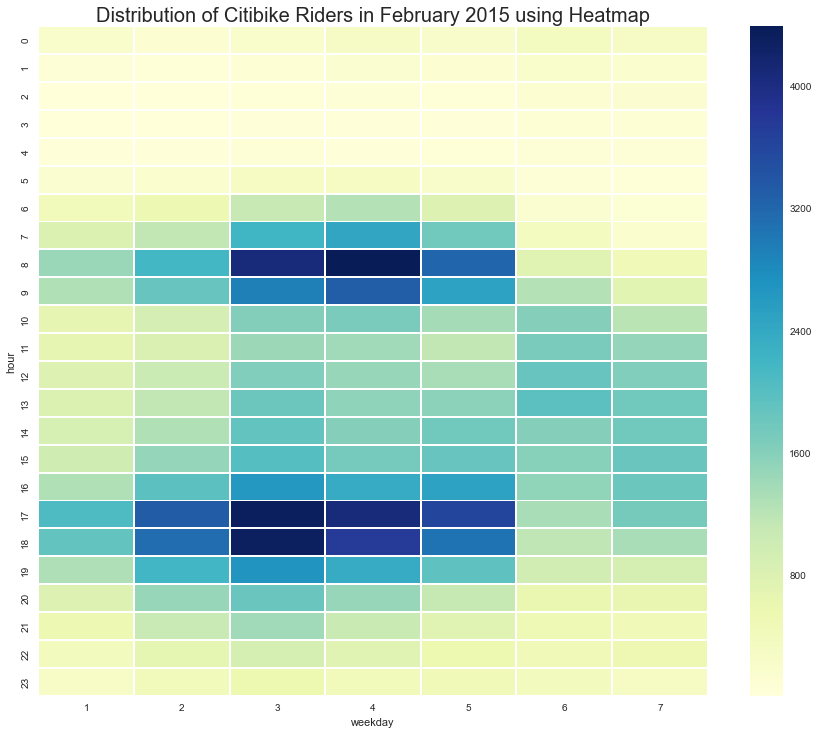

# Homework 8
My plot is a heatmap of the distribution of citibike riders in February 2015. 

The x-axis represents the weekday with 1 = Monday, 2 = Tuesday, ... , 6 = Saturday and 7 = Sunday. 

The y-axis represents the 24 hours per day. 

The color of each small block represents the number of riders at that hour on that particular weekday, with deep blue stands for a large numer of riders and light yellow stands for a small number of riders. 

