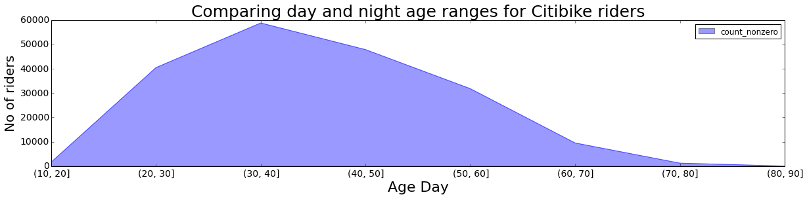
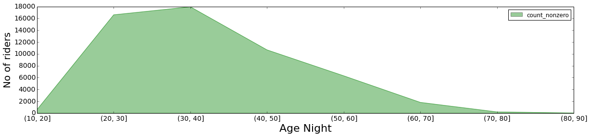

## Review on the plot of avigailvantu
### CLARITY: 
The labels of the x-axis are a little bit hard to understand. The labels of the legends (on the top right corner) of the two plots should be named differently.

###ESTHETIC: 
The colors are chosen appropriately. 

###HONESTY: 
The y-axis interval of the day plot is a lot wider than that of the night plot, while the lengths of the two y-axis look almost the same, giving audience a misleading impression that there is not much difference of the total number of riders in daytime comparing to nighttime, which is not the truth.

###SUGGESTIONS:
+ Maybe it would be better if the the two lines were plotted on the same graph using the same y-axis.
+ Please include a README file in the right directory (HW8 instead of HW9).

